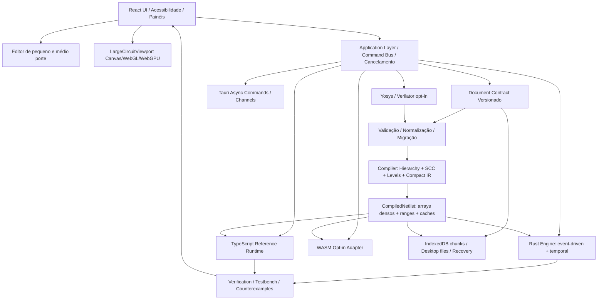

# VERITAS — Arquitetura do Digital Logic Simulator escalável até 25 mil chips

**Status:** proposta técnica para implementação incremental. Não é declaração de suporte já disponível.

**Data:** 2026-08-27

**Escopo:** definir o que será necessário para o Veritas se tornar um Digital Logic Simulator próprio, leve, determinístico, local-first, offline-first, privacy-first e capaz de evoluir até um alvo de engenharia de **25.000 chips lógicos**.

**Regra principal:** 25 mil chips é um alvo de capacidade a ser comprovado por benchmarks e QA. Não é permitido apenas aumentar os limites atuais do `CircuitDocument` e declarar suporte.

## 1. Decisão executiva

O Veritas deve manter a arquitetura **React → Vite → Tauri 2 → Rust**. React continuará sendo a camada de produto, interação, painéis e edição; Rust será desenvolvido como núcleo de compilação e simulação de alta escala, primeiro atrás de um adaptador explícito e com fallback TypeScript. Tauri continuará sendo o shell desktop e a ponte controlada entre WebView e Rust.

A decisão não é substituir todo o Veritas por outro framework. A decisão é separar os caminhos que hoje estão acoplados:

```text
Documento editável
        ↓
Validação e normalização
        ↓
Compilação para IR/netlist compacto
        ↓
Runtime incremental event-driven
        ↓
Verification determinística
        ↓
Snapshots/deltas para a aplicação
        ↓
Renderer de viewport grande
```

O editor React Flow atual permanece útil para circuitos pequenos e médios. Para projetos grandes, o Veritas deve usar um viewport próprio baseado em Canvas/WebGL/WebGPU, com culling, níveis de detalhe, índice espacial e atualização por regiões. React não deve receber nem reconciliar 25 mil componentes individuais a cada mudança.

A simulação de 25 mil chips não deve ser uma árvore de objetos como contrato de produção. O documento pode conservar IDs e hierarquia legíveis; o compilador deve produzir arrays densos, índices compactos, faixas de conexões, caches por subcircuito e uma fila de eventos. O runtime só deve tocar no subgrafo sujo e só deve emitir sinais que mudaram.

## 2. O que foi aprendido com SebLague/Digital-Logic-Sim

A referência auditada é uma aplicação Unity/C# pública, organizada em módulos de descrição, jogo/editor, gráficos, persistência e simulação. O núcleo possui `Simulator`, `SimChip` e `SimPin`; os descritores possuem chips, subchips e fios; a visualização possui desenho em camadas e desenho instanciado [1] [2] [3].

O simulador de referência percorre uma árvore de `SimChip` e subchips. Ele propaga entradas, processa subchips que estão prontos, propaga saídas e, quando encontra dependências cíclicas, escolhe um subchip restante. Em uma primeira passagem, calcula uma ordem de visita; depois reutiliza essa ordem e permite reordenação dinâmica ocasional para condições de corrida. O próprio código lista como otimizações futuras lookup tables para chips combinacionais, ignorar chips cujas entradas e estados não mudaram e construir uma rede de conexões simplificada usando chips builtin [2].

A representação de simulação da referência usa arrays de pinos e subchips, com estado interno por chip. `SimPin` mantém fan-out, contagem de conexões, valores e origem do último sinal. Isso é uma boa demonstração de que a propagação deve ser separada da UI, mas o modelo de objetos por chip e a recursão não devem ser copiados para o hot path de 25 mil chips.

A camada visual usa uma infraestrutura de desenho instanciado, buffers estruturados e argumentos de desenho indireto [3]. A lição útil é renderizar muitos elementos como dados compactos em lote, não como milhares de objetos de UI independentes. No Veritas, essa ideia será adaptada para um renderer web/desktop compatível com a stack existente.

| Ideia observada | Decisão para o Veritas |
| --- | --- |
| Separação entre descrição, simulação, gráficos e persistência | Adotar fronteiras explícitas entre domínio, engine, renderer e storage |
| Ordem de visita calculada e reutilizada | Compilar níveis, SCCs e planos determinísticos antes da execução |
| Propagação por conexões e fan-out | Usar arrays compactos e índices de dependência |
| Lookup/cache para combinacional | Implementar memoização e cache estrutural por hash após paridade |
| Ignorar chips sem mudança | Usar runtime event-driven com dirty set e fila de eventos |
| Desenho instanciado | Usar geometria em lote e viewport-aware |
| Randomização de conflitos da referência | Não copiar; o Veritas deve ter política explícita e determinística |
| Árvore recursiva de objetos | Manter hierarquia no documento, mas achatar/compilar no runtime |
| Estado global e atualização orientada a frame | Isolar estado por sessão de simulação e por documento |

A referência é uma fonte de ideias arquiteturais, não uma autorização para copiar código, assets, nomes internos ou decisões de produto. O Veritas deve manter sua própria implementação e respeitar a licença e os avisos do projeto de referência se algum código ou asset externo vier a ser incorporado no futuro [4].

## 3. Diagnóstico do gargalo atual do Veritas

O contrato atual do `CircuitDocument` limita documentos editoriais a **256 nós**, **512 conexões** e **500.000 bytes serializados**. Esse limite é deliberado porque o caminho de produto inclui editor, validação, renderização, persistência, importação e exportação; não basta o `Simulator` bruto conseguir consumir um netlist maior [5].

A baseline existente confirma a diferença. Para uma cadeia `input → N × NOT → output`, o caminho `CircuitDocument → Simulator` mede 0,642 ms em 10 gates e 16,519 ms em 100 gates, enquanto 500, 1000 e 5000 gates continuam `NOT SUPPORTED` no produto. O caminho `Netlist → Simulator` bruto mede 211,942 ms em 500 gates, 423,762 ms em 1000 e 6.273,959 ms em 5000 na máquina da baseline [5]. Esses valores são evidência de custo observado em um ambiente específico, não promessa de desempenho.

O problema não é somente o algoritmo de simulação. O editor atual mantém arrays inteiros de nodes e edges em estado React Flow, deriva o `CircuitDocument` a partir deles e concentra editor, colaboração, storage, IA, seleção e runtime no mesmo componente. Em um projeto com dezenas de milhares de elementos, essa combinação tende a produzir cópias, re-renderizações e trabalho de reconciliação desnecessário. A documentação oficial do React Flow recomenda memoização, seleção separada, evitar acesso amplo aos arrays de nodes/edges, colapsar árvores grandes e simplificar estilos [6].

O limite atual deve permanecer até que exista um contrato de escala com modelo de dados, budgets, renderização parcial, persistência, segurança, benchmark e QA multiplataforma. A arquitetura abaixo cria esse caminho sem quebrar os documentos existentes.

## 4. Definição de capacidade

A expressão “25 mil chips” precisa ser precisa. O alvo de engenharia adotado é:

| Conceito | Definição |
| --- | --- |
| Chip lógico | Uma instância editorial de componente no circuito compilado, podendo ser builtin ou uma instância hierárquica referenciada |
| Gate expandido | Um elemento interno após flattening; não deve ser confundido automaticamente com chip editorial |
| Projeto de 25 mil | Um documento que contém até 25.000 instâncias lógicas antes de qualquer expansão interna, com conexões, largura de sinais e estado declarados por contrato |
| Suporte de produto | Editor, simulação, verification, salvar, reabrir, importar, exportar, undo/redo e desktop funcionando com budgets explícitos |
| Capacidade bruta | Um benchmark interno que pode consumir uma representação sem provar UX, persistência ou distribuição |

O Veritas deve publicar capacidades em níveis:

1. **Compatibilidade legada:** documentos atuais continuam abrindo com o formato e os limites existentes.
2. **Circuito grande experimental:** representação compilada e viewport grande podem ser ativados por feature flag, com budgets e classificação `EXPERIMENTAL`.
3. **Circuito grande de produto:** só depois de round-trip, UI, simulation, verification, memory, cancellation e QA Windows/macOS/Linux.
4. **25K validated:** só depois de uma matriz fixa de topologias, hardware de referência, repetição e evidência por release.

O número 25.000 não deve ser usado no marketing ou no README como suporte garantido antes do quarto nível.

## 5. Ferramentas e bibliotecas recomendadas

A lista está dividida entre o mínimo necessário, ferramentas de apoio e integrações opcionais. Adicionar bibliotecas sem necessidade contradiz o objetivo de manter o aplicativo leve.

### 5.1 Núcleo e compilador Rust

| Ferramenta/biblioteca | Papel | Decisão |
| --- | --- | --- |
| Rust stable + Cargo | Núcleo determinístico, compilação e runtime desktop | Obrigatório; já existe uma fatia experimental em `engine-rs/` |
| `std::vec::Vec`, slices e tipos numéricos | Arrays densos e hot path | Obrigatório antes de qualquer crate de arena |
| `serde`/`serde_json` na fronteira | Contratos serializáveis e compatibilidade | Usar somente na borda; não trafegar snapshots gigantes em JSON |
| `thiserror` ou erros estruturados equivalentes | Erros tipados e fail-closed | Recomendado para códigos de erro estáveis |
| `petgraph` | Análise, SCC, topological sort, diagnóstico e exportação DOT | Recomendado no compilador; não usar automaticamente no hot path de cada tick. A biblioteca oferece diferentes estruturas e trade-offs de memória/índice [7] |
| `generational-arena` ou slot IDs equivalentes | IDs seguros durante edição e remoção | Opcional no modelo de edição; o netlist compilado deve preferir índices densos |
| `rayon` | Paralelismo de lotes independentes e verification | Opcional e posterior; usar somente quando a ordem determinística puder ser provada [8] |
| `criterion` ou benchmark equivalente | Microbenchmarks reproduzíveis do Rust | Recomendado para engine e compilador, separado de benchmarks de UX |
| `proptest`/fuzzing controlado | Testes de propriedades, parser, importação e invariantes | Recomendado para hardening, com budgets |

O `petgraph` é adequado para descobrir dependências, componentes fortemente conectados e planos de execução, mas uma estrutura genérica de grafo com alocações e pesos arbitrários não deve ser presumida como a representação mais leve para cada tick. Depois da compilação, o runtime deve usar buffers próprios, `u32` para índices quando o contrato permitir e ranges contíguos.

`rayon` não deve ser usado para “paralelizar tudo”. Propagação causal, clocks e escrita de estado exigem ordem e barreiras. O primeiro uso seguro é em verification de casos independentes, compilação de partições independentes e preparação de geometrias, sempre com resultado ordenado por ID.

### 5.2 WebView e frontend

| Ferramenta/biblioteca | Papel | Decisão |
| --- | --- | --- |
| React + TypeScript | Produto, painéis, comandos, acessibilidade e editor de pequeno/médio porte | Manter |
| Vite | Build e desenvolvimento | Manter |
| React Flow | Editor atual e compatibilidade de circuitos pequenos/médios | Manter como renderer de compatibilidade; não usar como árvore obrigatória de 25 mil elementos |
| Canvas 2D | Primeiro renderer grande com poucas dependências | Recomendado como baseline; adequado para desenho por viewport e fallback |
| Web Worker | Tirar compile/simulação do thread da UI | Obrigatório para operações grandes no caminho web quando suportado |
| `OffscreenCanvas` | Renderizar em worker sem dependência total do DOM | Recomendado; MDN documenta que ele desacopla Canvas/DOM e permite executar rendering em worker [9] |
| WebGL2 | Backend acelerado quando Canvas 2D não atingir o budget | Opcional, com fallback Canvas |
| WebGPU | Renderização/compute moderno e potencial para lotes enormes | Opcional, experimental; WebGPU expõe renderização e computação GPU, mas exige validação, budgets e tratamento de limites [10] |
| PixiJS | Batching, sprites e culling prontos | Opcional; usar somente se o renderer próprio não atingir o objetivo. A documentação alerta que culling ajuda em GPU-bound e pode piorar CPU-bound [11] |
| Zustand ou store equivalente | Seleção, viewport, filtros e estado de UI granular | Recomendado somente para slices isolados; não duplicar o `CircuitDocument` inteiro no store |

A recomendação de implementação é começar com um `LargeCircuitViewport` próprio em Canvas 2D, mantendo o React responsável pelo shell e pelos painéis. Um backend WebGL2/WebGPU pode ser escolhido por feature detection e benchmark, nunca por suposição de que todos os computadores do usuário têm a mesma GPU.

### 5.3 Tauri 2 e comunicação

Tauri 2 continua sendo o shell. A arquitetura oficial combina WebView e backend Rust por message passing e oferece comandos tipados, comandos assíncronos e canais para streaming [12] [13].

| Mecanismo | Uso no Veritas |
| --- | --- |
| Command tipado | `compile_project`, `run_tick`, `run_verification`, `cancel_job`, `load_chunk` |
| Async command | Compilação, simulação e import/export que podem demorar |
| Channel/event stream | Progresso, deltas de sinais, chunks, métricas e cancelamento cooperativo |
| Retorno binário/bytes | Snapshots ou buffers grandes, evitando JSON completo a cada frame |
| Estado Tauri | Sessões de engine isoladas, com lifecycle e shutdown idempotente |
| Fallback web | Worker TypeScript/WasM quando não houver backend Tauri |

O frontend não deve enviar 25 mil nodes completos por IPC em cada alteração. Deve enviar comandos pequenos, IDs afetados ou um snapshot versionado somente quando necessário. O backend deve rejeitar payloads acima dos budgets antes de alocar.

### 5.4 HDL e ferramentas de hardware

| Ferramenta | Papel futuro | Limite |
| --- | --- | --- |
| Yosys | Importação/síntese de subconjunto RTL e technology mapping | Backend opt-in; não executar Verilog arbitrário como se fosse o runtime nativo |
| Verilator | Co-simulação ou modelo compilado para HDL verificado | Backend opt-in; processo/worker isolado, timeout, checksum e equivalence gate |
| Graphviz | Diagnóstico/exportação de grafos | Ferramenta de análise, não renderer do editor grande |
| Rust/WASM próprio | Runtime compacto no browser | Só ativar após paridade, tamanho, cold start, memória, repetição e fallback |

A documentação do Yosys descreve RTL como uma representação de células/registros e sinais que pode ser codificada como netlist; isso confirma que o netlist compilado é uma fronteira natural para o Veritas [14]. A documentação do Verilator organiza geração de modelos, wrappers, runtime, benchmark, coverage e profiling, o que é útil para um backend HDL, mas não substitui o runtime pedagógico do Veritas [15].

## 6. Arquitetura em camadas



### 6.1 Document Contract

O documento editável permanece legível e compatível com o Veritas atual. Ele contém IDs estáveis, posição, labels, tipos, largura, conexões, hierarquia, metadados e versão. O documento não deve armazenar referências diretas a objetos em memória.

Regras:

- IDs públicos são estáveis e não dependem da posição em um array.
- Cada alteração estrutural incrementa uma versão de documento.
- O documento é validado antes de compile, save, import ou execução.
- Versões futuras são rejeitadas, não “corrigidas” em silêncio.
- Migrações são determinísticas e preservam um checksum do conteúdo lógico.
- Um documento grande não é serializado como um único estado React a cada evento.

### 6.2 Compiler Pipeline

O compilador executa uma única sequência canônica:

```text
parse/import
  → shape validation
  → semantic validation
  → normalize IDs and widths
  → resolve custom-chip references
  → detect missing/cyclic hierarchy
  → compile reusable definitions
  → instantiate dense indices
  → classify sequential/combinational boundaries
  → build adjacency ranges
  → compute SCCs and combinational levels
  → emit CompiledNetlist
```

O compilador deve separar três conceitos que atualmente podem se misturar: ciclo hierárquico inválido, feedback temporal válido e ciclo combinacional que requer diagnóstico. SCC é útil para a análise, mas a classificação final deve respeitar o contrato temporal do componente.

Definições de chips customizados devem ser imutáveis após compilação e identificadas por hash estrutural. Muitas instâncias do mesmo chip devem compartilhar a definição compilada; apenas entradas, saídas, parâmetros e estado devem ser específicos da instância. Isso evita expandir repetidamente a mesma estrutura interna.

### 6.3 CompiledNetlist

A representação compacta deve ser orientada a dados. Uma forma inicial é:

```text
NodeRecord[]
  kind: u16
  flags: u16
  input_start: u32
  input_len: u32
  output_start: u32
  output_len: u32
  state_start: u32
  state_len: u32
  level: u32

InputRef[] / OutputRef[]
  source_node: u32
  source_port: u16
  target_node: u32
  target_port: u16

SignalBuffer
  width: u8
  word_offset: u32
  word_len: u16
  current/next state as packed words

DirtyQueue
  node_id: u32
  generation/epoch: u32

DefinitionTable
  structural_hash
  builtin_kind or compiled body reference
  public pin map
```

A estrutura real pode mudar após benchmarks. O requisito é evitar `String` e alocações por operação no hot path. Labels e IDs humanos ficam em tabelas de metadata; o runtime usa índices densos.

Para sinais de até 64 bits, o Veritas pode continuar usando uma palavra mascarada, alinhada com o contrato atual. Sinais maiores devem usar slices de palavras com largura explícita, sem fingir que um `u64` representa um barramento arbitrário.

### 6.4 Runtime event-driven incremental

O runtime recomendado é um simulador de eventos discretos com barreiras temporais:

1. O host aplica mudanças de entradas, clock ou comandos.
2. Cada mudança marca somente os consumidores diretos como dirty.
3. Uma fila determinística processa nós dirty em ordem estável.
4. O nó calcula sua saída a partir de sinais atuais.
5. Se a saída mudou, somente o fan-out é enfileirado.
6. Quando a fila combinacional esvazia, o estado é estável para aquele delta-cycle.
7. Componentes temporais publicam `next_state` numa barreira de tick.
8. O scheduler incrementa o tick e inicia a próxima janela.

Pseudocódigo:

```text
apply_external_inputs()
mark_changed_sources()

while dirty_queue not empty:
    node = pop_lowest_stable_id()
    if node already processed in current epoch: continue
    new_output = evaluate(node, current_signals, state)
    if new_output != old_output:
        write_output(node, new_output)
        enqueue_fanout(node)
    operations += 1
    check_budget_and_cancel()

commit_temporal_next_state()
return stable_snapshot_or_diagnostic()
```

A fila deve ser determinística. Não se deve usar a randomização de conflito da referência como semântica. Entradas conflitantes precisam de uma política explícita: erro estrutural, resolução tri-state formal ou regra documentada para o componente.

O runtime deve possuir:

- budget por operação;
- budget por delta-cycle;
- budget por tick;
- budget total da execução;
- budget de memória;
- token de cancelamento;
- shutdown idempotente;
- diagnóstico serializável;
- snapshot incremental ou delta;
- contagem de operações e nós realmente processados.

### 6.5 Verification

A engine de referência TypeScript continua sendo a autoridade de paridade durante a migração. O runtime Rust/compiled só pode virar caminho de produção para uma superfície após:

```text
mesmo documento
→ mesmo CompiledNetlist
→ mesmas entradas
→ mesma sequência temporal
→ mesmos outputs
→ mesmos snapshots
→ mesmo diagnóstico
→ mesmo checksum
```

O testbench deve separar:

| Resultado | Significado |
| --- | --- |
| `PASS` | Expectativas e diagnóstico compatíveis |
| `FAIL` | Primeiro sinal, tick, output ou snapshot divergente |
| `INVALID` | Documento, testbench, budget ou fixture inválido antes da execução |
| `cycle-detected` | Diagnóstico operacional bounded, não automaticamente falha lógica |
| `budget-exhausted` | Execução interrompida com segurança; resultado não pode ser tratado como PASS |

Para cada FAIL, o relatório deve trazer entradas, tick, sinal divergente, esperado, observado, snapshot anterior e checksum. Para cada INVALID, deve trazer o caminho do campo e o motivo acionável.

## 7. Renderer para 25 mil chips

O renderer grande não deve criar um componente React por node. A camada visual deve consumir buffers ou snapshots de geometria e renderizar somente o que o viewport pode mostrar.

### 7.1 Níveis de detalhe

| Zoom/estado | Renderização |
| --- | --- |
| Zoom próximo | Chips, pinos e labels dos elementos visíveis |
| Zoom médio | Símbolos simplificados, labels selecionados e bundles de fios |
| Zoom distante | Blocos, regiões e densidade; sem texto por chip |
| Pan/zoom em progresso | Geometria simplificada; labels e hit-testing detalhados após estabilização |
| Seleção/foco | Renderizar somente a seleção, vizinhança e caminho relevante com detalhe |

### 7.2 Índice espacial

Um índice espacial uniforme por tiles é suficiente para a primeira versão e reduz dependências. Cada chip e segmento de fio entra em células calculadas por bounding box. O renderer consulta somente células visíveis e uma margem pequena. A seleção global deve ser uma coleção de IDs, não um filtro sobre todos os nodes a cada render.

Geometria estática deve ser cacheada por versão estrutural. O movimento de um chip invalida somente as células afetadas e os fios conectados. A mudança de sinal invalida somente a camada de estado, não toda a geometria.

### 7.3 Interação

Hit-testing deve consultar o índice espacial. Ações como selecionar, conectar, mover e abrir o inspector usam IDs compactos e depois consultam metadata no documento. O painel React não deve receber todos os elementos do viewport para descobrir qual foi clicado.

A renderização em `OffscreenCanvas` é preferível para operações pesadas quando o ambiente oferecer suporte. O caminho principal precisa manter fallback Canvas 2D no thread da UI para compatibilidade. WebGPU pode ser adicionado como backend opcional; suas validações, limites, buffers e custos de transferência devem ser observados conforme a especificação [10].

## 8. Persistência e distribuição

Para documentos grandes, o armazenamento deve ser dividido entre:

```text
ProjectManifest
  metadata, version, checksums, chunk index

DocumentChunks
  nodes, edges, hierarchy, layout regions

CompiledCache
  optional, disposable, keyed by document hash + engine version

RuntimeCheckpoint
  optional, bounded, separate from structural document

VerificationReports
  serializable, reproducible, linked by document/testbench hash
```

O cache compilado pode ser descartado e reconstruído. O documento estrutural nunca deve depender do cache para abrir. Chunks devem ter tamanho máximo, checksum e ordem determinística. Falha em um chunk deve produzir recovery/rejeição explícita, não um projeto parcialmente silencioso.

Na web, IndexedDB continua sendo o armazenamento local-first. No desktop, Tauri pode oferecer operações de arquivo nativas, mas sempre via comandos permitidos, caminhos validados e sem executar conteúdo importado. A atualização deve preservar arquivos antigos e possuir rollback documentado.

A distribuição Windows, macOS e Linux é parte do produto. O alvo Windows continua exigindo `Veritas-Setup.exe`; isso só é considerado completo quando o instalador, startup, abertura, simulação, save/reopen, shutdown, remoção e atualização tiverem evidência real. Build e asset sozinhos não provam runtime.

## 9. Plano de migração sem reescrever tudo

### Fase A — contratos e medição

1. Congelar os contratos atuais do `CircuitDocument`, `Netlist`, `DocumentRuntime`, testbench e snapshots.
2. Adicionar fixtures determinísticas de 1k, 5k, 10k e 25k na representação compilada, sem liberar esses tamanhos no editor atual.
3. Medir compile, first run, steady state, memory, operations, snapshot size e cancellation.
4. Corrigir a metadata `core_version` dos relatórios desktop antes de qualquer nova release.

### Fase B — compiler/IR

1. Criar `CompiledNetlist` versionado.
2. Implementar normalização, IDs densos, adjacency ranges, fan-out, levels e SCC.
3. Cachear definições de chips customizados por hash.
4. Manter o `Netlist` atual como adaptador de compatibilidade.
5. Testar equivalência estrutural e rejeições fail-closed.

### Fase C — runtime incremental

1. Implementar fila dirty e emissão somente quando output muda.
2. Separar combinacional delta-cycle de barreira temporal.
3. Migrar primeiro verification/testbench, não a UI inteira.
4. Adicionar budgets, cancelamento e cleanup.
5. Rodar TypeScript e Rust sobre os mesmos fixtures e comparar checksums.

### Fase D — worker/Tauri

1. Expor jobs assíncronos por Worker na web.
2. Expor comandos async e canais no Tauri.
3. Retornar deltas/chunks, nunca snapshots JSON gigantes em cada evento.
4. Cancelar e descartar jobs obsoletos quando o documento mudar.
5. Provar que a UI continua responsiva sob carga.

### Fase E — large viewport

1. Criar `LargeCircuitViewport` fora de React Flow.
2. Implementar índice espacial, tiles, LOD, culling e dirty regions.
3. Manter seleção, inspector, conexão e undo/redo compatíveis.
4. Ativar o viewport grande por capability detectada e budget, não por tamanho fixo não medido.
5. Usar React Flow em modo de compatibilidade para documentos menores.

### Fase F — persistência e release

1. Versionar chunks e migrações.
2. Testar Web ↔ PWA ↔ Desktop com os mesmos arquivos.
3. Adicionar save/reopen/import/export para 25k em ambiente de teste.
4. Repetir benchmarks em Windows, macOS e Linux.
5. Só então alterar limites oficiais e anunciar uma capacidade de circuito grande.

## 10. Benchmarks obrigatórios

O benchmark de 25k deve usar pelo menos estas topologias:

| Topologia | Por que existe |
| --- | --- |
| Cadeia linear de NOT | Custo de profundidade e propagação |
| Fan-out de uma fonte | Custo de distribuição |
| Árvore de redução | Custo de níveis e filas |
| Grade/mesh | Conexões e regiões espaciais |
| Hierarquia repetida | Compartilhamento de definições e instâncias |
| Sequencial com clock | Estado, barreira e waveform |
| Multi-bit | Largura de sinais e memória |
| Chips customizados | Elaboração, cache e boundaries |
| Circuito inválido | Rejeição antes de alocar/executar |

Cada cenário deve registrar:

- tempo de validação;
- tempo de compilação;
- cold start;
- primeiro tick;
- ticks steady-state;
- operações processadas;
- máximo da fila;
- memória peak/RSS;
- bytes do documento e dos chunks;
- tamanho de snapshots/deltas;
- tempo de import/export;
- tempo de cancelamento;
- FPS ou latência de pan/zoom/seleção;
- checksum de outputs;
- plataforma, CPU, memória, versão do engine e versão do documento.

Os critérios numéricos finais devem ser escolhidos após a primeira medição comparável. Como metas de engenharia iniciais, não como promessas, recomenda-se investigar p95 de interação visual abaixo de um frame perceptível, compilação cancelável, steady-state proporcional ao número de eventos e memória que não cresça linearmente com a expansão repetida de chips hierárquicos.

## 11. Segurança e determinismo

A escala aumenta a superfície de negação de serviço. Todo caminho que aceita documento, chip, testbench ou HDL precisa validar tamanho, profundidade, fan-out, largura, número de conexões, bytes, operações e memória antes de executar.

Regras obrigatórias:

- nunca usar `eval` ou `Function` para lógica recebida;
- nunca executar JSON DLS, Verilog ou código importado como JavaScript/Rust;
- permitir somente componentes e comandos allowlisted;
- rejeitar versões futuras e schemas inválidos;
- cancelar jobs antigos ao trocar documento;
- impedir mutação silenciosa do projeto por IA;
- manter outputs, snapshots e checksums determinísticos;
- não usar aleatoriedade para resolver semântica funcional;
- separar cache descartável de documento autoritativo;
- registrar budgets e o motivo de cada parada;
- manter fallback offline e local-first.

WebGPU exige validação estrita de comandos e atenção a acessos fora dos limites, memória e consumo computacional [10]. Isso reforça que GPU deve ser acelerador opcional, não autoridade semântica.

## 12. Mapa na fila mestre até v5.0.0

| Fase da fila | Contribuição para o objetivo de 25k |
| --- | --- |
| v2.6.0 Verification | Relatórios, snapshots, contraexemplos e paridade antes de otimizar |
| v2.7.0 Execution Safety | Budgets, cancelamento, timeouts, cleanup e testes adversariais |
| v2.8.0 Project Format | Chunks, migrações, round-trip e recovery |
| v2.9.0 Pre-3.0 | Boundaries e inventário para evitar acoplamento destrutivo |
| v3.0.0 Core Modular | Compiler, engine, storage, renderer e verification separados |
| v3.1–v3.2 | Plugins com capabilities e budgets; não podem comprometer o engine |
| v3.3–v3.5 | Workspace grande, acessibilidade, performance e viewport |
| v3.6–v3.7 | HDL e co-simulação controladas |
| v3.8.0 Scale | Renderização incremental, netlist compacto, benchmarks e memória |
| v4.x | Packages, reprodutibilidade, colaboração/automação opt-in e distribuição |
| v5.0.0 | Plataforma integrada, reproduzível e validada nos três sistemas |

A fila completa permanece em [`VERITAS_MASTER_BUILD_QUEUE.md`](./VERITAS_MASTER_BUILD_QUEUE.md), e o roadmap macro em [`VERITAS_V3_V5_ROADMAP.md`](./VERITAS_V3_V5_ROADMAP.md).

## 13. Critério final de “nosso próprio Digital Logic Simulator”

O Veritas poderá ser chamado de Digital Logic Simulator próprio quando possuir, no mínimo:

1. editor visual com documento versionado e persistente;
2. engine canônica própria para combinacional e sequencial;
3. chips builtin e customizados com hierarquia segura;
4. verification determinística com contraexemplos;
5. budgets e cancelamento em todos os caminhos custosos;
6. import/export sem execução arbitrária;
7. waveform, clocks, flip-flops, multi-bit e testbench;
8. renderer grande independente da árvore React;
9. fallback TypeScript e backend Rust/WASM comprovadamente equivalentes onde aplicável;
10. integração Tauri 2 com comandos async, canais e arquivos locais seguros;
11. build, artefatos, runtime e smoke verificados separadamente;
12. Windows, macOS e Linux com instaladores, incluindo `Veritas-Setup.exe`;
13. save/reopen/import/export reais nas três plataformas;
14. documentação, migração, recovery, rollback e matriz de QA;
15. nenhuma regressão P0/P1 conhecida na superfície crítica.

A validação de 25 mil chips só pode ser anunciada quando todos esses itens estiverem acompanhados de evidência. Um benchmark do netlist ou um build Tauri verde não é suficiente.

## 14. Referências

[1]: https://github.com/SebLague/Digital-Logic-Sim "SebLague/Digital-Logic-Sim — repositório de referência"
[2]: https://raw.githubusercontent.com/SebLague/Digital-Logic-Sim/main/Assets/Scripts/Simulation/Simulator.cs "Simulator.cs — propagação e ordem de simulação"
[3]: https://github.com/SebLague/Digital-Logic-Sim/blob/main/Assets/Scripts/Seb/SebVis/Internal/InstancedDrawer.cs "InstancedDrawer.cs — desenho instanciado"
[4]: https://github.com/SebLague/Digital-Logic-Sim/blob/main/LICENSE "Licença MIT da referência"
[5]: ./LARGE_CIRCUITS.md "Decisão atual do Veritas sobre circuitos grandes"
[6]: https://reactflow.dev/learn/advanced-use/performance "React Flow — performance em grafos grandes"
[7]: https://docs.rs/petgraph/latest/petgraph/ "petgraph — estruturas e algoritmos de grafos"
[8]: https://docs.rs/rayon/latest/rayon/ "Rayon — paralelismo de dados em Rust"
[9]: https://developer.mozilla.org/en-US/docs/Web/API/OffscreenCanvas "MDN — OffscreenCanvas em Web Workers"
[10]: https://www.w3.org/TR/webgpu/ "W3C — especificação WebGPU"
[11]: https://pixijs.com/8.x/guides/concepts/performance-tips "PixiJS — dicas oficiais de performance"
[12]: https://v2.tauri.app/concept/architecture/ "Tauri 2 — arquitetura"
[13]: https://v2.tauri.app/develop/calling-rust/ "Tauri 2 — commands, async e channels"
[14]: https://yosyshq.readthedocs.io/projects/yosys/en/stable/appendix/primer.html "Yosys — primer de síntese digital"
[15]: https://verilator.org/guide/latest/ "Verilator — documentação oficial"


## 15. Fronteira comercial: demo, edição final, DLC e nuvem opt-in

A escala de 25 mil chips continua sendo uma capacidade técnica do produto, não um motivo para corromper ou bloquear projetos locais. A demo poderá mostrar uma fatia controlada da escala; a edição final paga e uma eventual expansão `Scale Lab` poderão entregar o compiler/IR, viewport e profiling avançados como capacidades licenciadas. A ausência da edição final ou desse DLC deve produzir diagnóstico recuperável, nunca apagar projetos ou ocultar dados locais.

Serviços de nuvem, incluindo backup, sincronização, histórico remoto, colaboração hospedada e compute remoto, ficam fora da autoridade do `CompiledNetlist` e do `Runtime`. Eles devem ser adaptadores opcionais com autenticação, quotas, entitlements, criptografia, exclusão/exportação e política de retenção. Login/licença não autorizam upload automático; o documento estrutural e o arquivo local continuam sendo a fonte recuperável pelo usuário.

A integração futura com Steam deverá ficar em um `EntitlementProvider`, sem espalhar chamadas de Steamworks pelo domínio. Ownership habilita uma edição, um DLC ou um serviço; não transforma conteúdo baixado em código confiável. Todos os DLCs e arquivos remotos continuam sujeitos a versão, checksum, schema, allowlist e budgets.

O modelo comercial detalhado, incluindo demo gratuita, edição final paga, DLC, Steam Wallet, cloud opt-in, privacidade e critérios de implementação, está em [`COMMERCIAL_MODEL_STEAM.md`](./COMMERCIAL_MODEL_STEAM.md).
